## What it is

ProjectForge is a work board, like a Trello board, that runs on your own computer and is written for AI agents. Each card is a single piece of work. Each card has an owner: one of your Claude Code agents, or you.

The board has up to 8 columns. **Awaiting You** comes first, because it is the only column that needs you. Then Backlog, Ready, In Progress, Blocked, Review and Done. An 8th column, Tracking, appears only once you connect another program, such as the address book you keep your clients and prospects in (your CRM), that sends in cards that just report a status and are not work for an agent. On the right is a live list of who did what and when, and any change the board refused (for example, an agent trying to move a card it is not allowed to move) shows there in red.

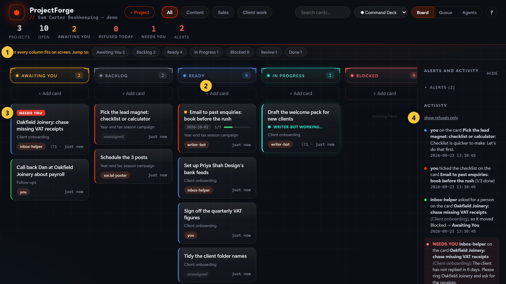

1. The bar that appears when the columns are wider than the window. Click a column name and the board scrolls to it.
2. **+ Add card**, at the top of every column.
3. A red **NEEDS YOU** label: an agent has asked for a person on this card, so the card has moved into Awaiting You. The header counts these under "needs you".
4. The Activity list: every change, newest first, each line naming the card and its project. Refusals and requests for a person are in red. **show refusals only** narrows it to the changes the board refused.

Not every column fits on a laptop screen. When they do not, a bar under the header names every column with its number of cards; click a name and the board scrolls to that column.

The Alerts and Activity panel on the right folds away too. Click **Hide** at the top of it and the columns take back the 270 pixels it was using; a **Show alerts and activity** tab appears on the right-hand edge, and clicking that brings the panel back. Both are ordinary buttons, so the Tab key reaches them and Return works them. The board remembers which way you left it, after a refresh and the next time you open it, and the board's own 10-second refresh never puts the panel back on its own. Anything that arrives while it is folded is counted on the tab itself, as **Show alerts and activity (2 new)**, so nothing is hidden from you without saying so.

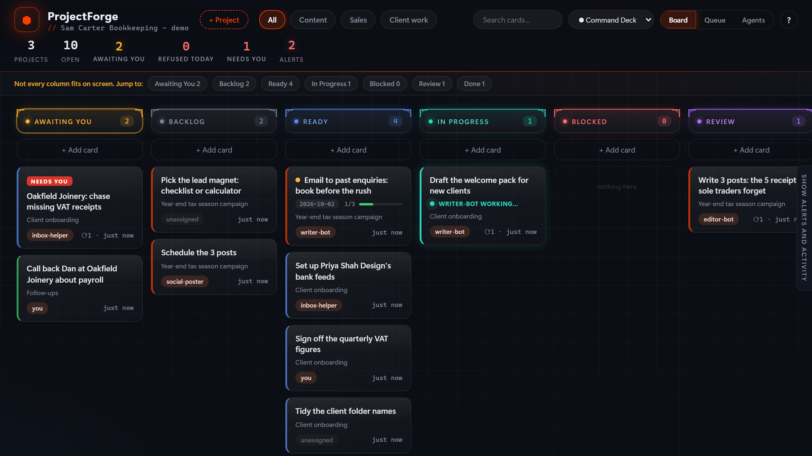

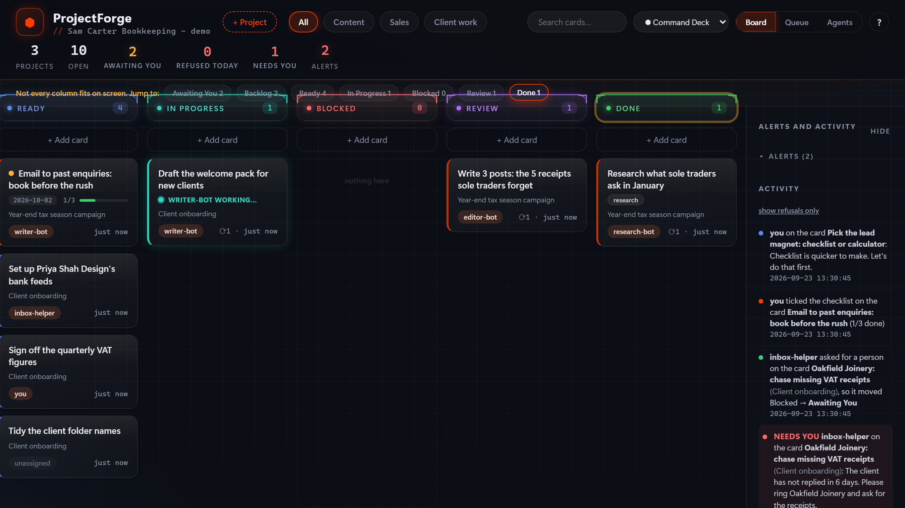

Click a card and you see its full record: notes, checklist, a link to a person in your CRM vault, every work report an agent saved on it (what it did, which files it made, the result, the next step), and every handover from agent to agent.

The board itself contains no AI. It stores the work and it enforces these rules:

1. **Managers open cards.** You choose which of your agents are managers. Every other agent is a worker.
2. **Workers only add to a card.** A worker can write a work report, a handover, a comment or an escalation (asking for a person: that marks the card NEEDS YOU and the board puts it in Awaiting You). A worker can never open a card, and never chooses which column a card sits in.
3. **Only the orchestrator moves cards.** The orchestrator is a single Claude Code session, started when you type `/forge-run` into Claude Code (the installer adds that command). It is the only agent allowed to move a card between columns. You can move cards too.
4. **Awaiting You is yours.** The orchestrator may put a card into it. Only you take a card out.

A handover between agents is refused unless it carries 5 fields: what was done, the decisions and why, where the work stands, what to do first, and warnings.

This is piece 3 of 4 in the agent workspace. Install them in order: 1 agent-flow (watch your agents hand work to each other, live), 2 FleetView (1 screen listing every agent you have), 3 ProjectForge (this work board), 4 Jeeves (a chief of staff that reads your vault and briefs you). Each one also works on its own.

### Words used in this guide

| Word | What it means here |
|---|---|
| Terminal | The text window where you type commands. On a Mac it is the Terminal app: press Command and Space together, type Terminal, press Return. |
| Agent | One of your Claude Code helpers, each defined by a file in your agents folder. |
| Orchestrator | The 1 Claude Code session, started by typing `/forge-run`, that hands cards to agents and is the only agent allowed to move them. |
| Take a card | What the orchestrator does to a card in Ready: marks it as being worked on and moves it to In Progress. |
| Work report | The written record an agent saves on a card after a job: what it did, files made, result, next step. The command that saves it is called `pass`. |
| A run | Typing `/forge-run` once: it checks the board, then hands out ready cards until none are left. |
| Token | The unit Claude's usage is counted in. 4 tokens are about 3 words. |
| 127.0.0.1 and localhost | 2 ways of writing "this computer". An address that starts with either of them opens only on your own computer. |
| Port | The number after the colon in an address such as http://127.0.0.1:3020. It picks out which program on your computer answers. In this set of 4: agent-flow 3001, FleetView 3010, ProjectForge 3020, Jeeves 4040. |
| `--actor` | The word you type near the end of a command to say who is making the change, as in `--actor you`. |
| Escalation | An agent asking for a person. It marks the card **NEEDS YOU**, counts it in the header, and moves the card into Awaiting You. |
| Health check | A scan with no AI in it that the board runs when it starts and every 10 minutes: cards past their due date, cards nobody has touched for 5 days, cards sitting in Blocked for 3 days, cards with no owner, and cards an agent took but never reported back on. |
| writer-bot, editor-bot, content-lead | Made-up agent names used in the examples. Type your own agents' names instead. |

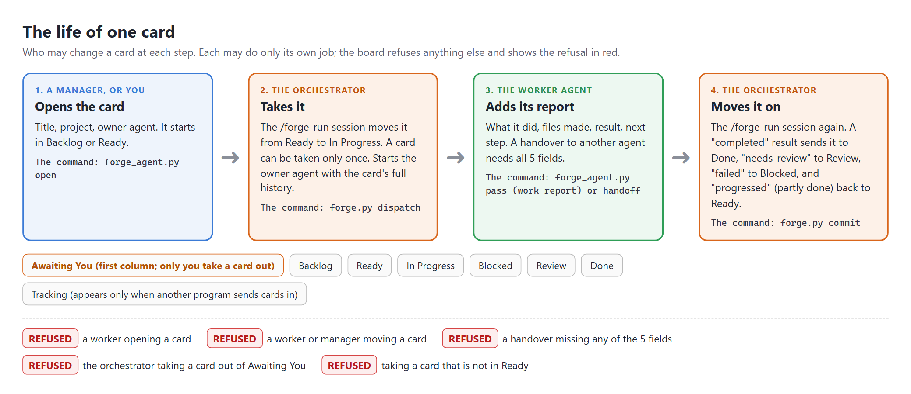

## Why you would want it

Once you have more than 5 agents, 3 problems appear.

- **Nobody can see what happened.** An agent finished a job on Tuesday. On Friday you, or another agent, have no written record of which files it made or what it left undone. The board keeps that record on the card.
- **Agents trip over each other.** An agent marks another agent's work as finished, or 2 runs pick up the same job. Only the orchestrator moves cards, so "this is now done" is decided in a single place, and the orchestrator can only take a card while it sits in Ready, so a second `/forge-run` cannot take the same card again.
- **Handovers are empty.** "Handed over to the editor" tells the editor nothing. The 5-field handover makes the first agent write down what the second agent needs.

It also gives you a column that is yours, Awaiting You, and anything that would reach another person (a post, an email, a message) stops in Review for you to check. The rules are on screen: click **?** at the top right.

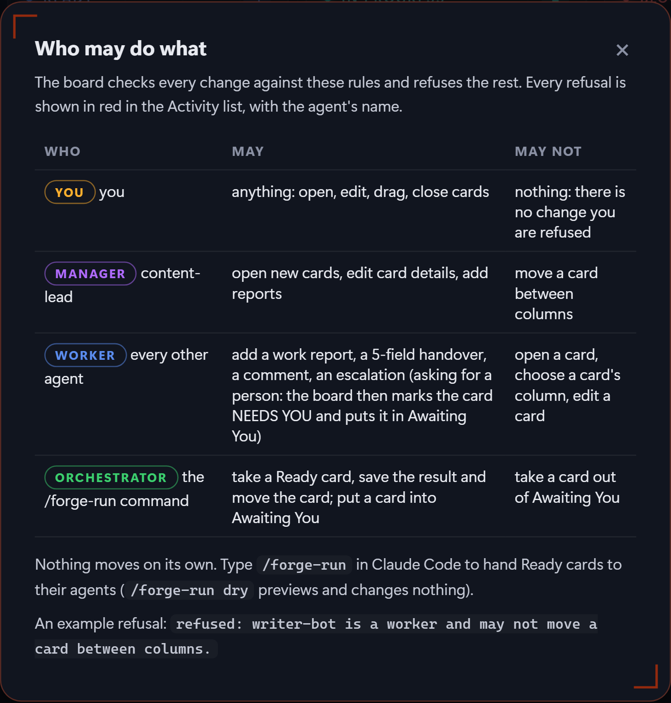

### What it is for

Keeping a written trail of every job your agents do, 1 card per job, each with an owner, a work report, and only 1 session, `/forge-run`, allowed to move a card to Done.

### What it writes outside its own folder

The installer names every path below on screen and asks "Go ahead?" before it writes any of them.

| It writes | Where | Can you switch it off? |
|---|---|---|
| The `/forge-run` command | `~/.claude/commands/forge-run.md` (the `.claude/commands` folder in your home folder), or your vault's `.claude/commands` if you answer `vault` at question 7. A file already there is copied to `forge-run.md.bak-<date>` first and put back when you uninstall. | No, but you choose which of the 2 folders |
| Your agents' tool | `~/.claude/projectforge/` (the `.claude/projectforge` folder in your home folder): `forge_agent.py`, `forge_client.py` and `forge_agent.json`, and nothing else. | No |
| The board summary note | The single file you name at question 8, inside your second brain, rewritten in full after every change. | Yes: type `none` |
| A start-up file | A LaunchAgent: a small file, `ai.outliers.projectforge.plist`, in the `~/Library/LaunchAgents` folder, that tells your Mac to start the board each time you switch on your Mac and sign in; no account of any kind is involved. | Yes: it is off unless you answer yes at question 9 |
| The optional schedule | A second LaunchAgent, `ai.outliers.projectforge.runifready.plist`, in the same `~/Library/LaunchAgents` folder. It checks the board on a timer and starts Claude only when a card is ready. Only written if you run `python3 tools/schedule.py --install`. | Yes: it is off unless you install it. `python3 tools/schedule.py --remove` or `python3 install.py --uninstall` takes it away |

Everything else the board keeps sits inside the download folder: the cards, the database at `data/forge.db`, and `config.json`. The picture below lists what it never touches.

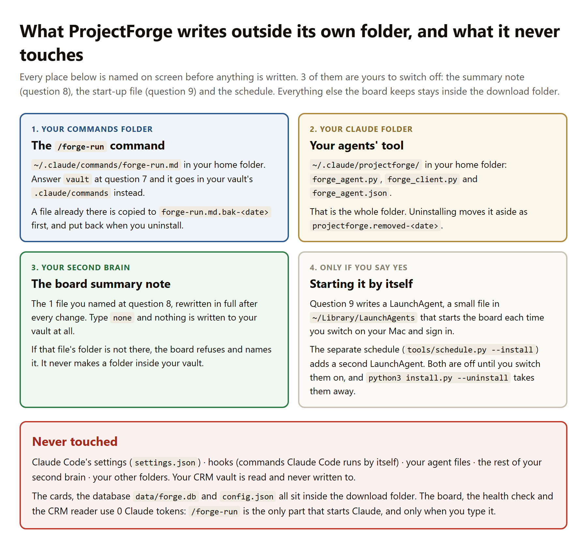

### Works well when

- **Your agents hand work to each other.** A writer finishes and an editor picks up. The board refuses the handover unless the writer has filled in all 5 fields, so the editor is never left with "handed over" and nothing else.
- **You need Tuesday's work on Friday.** Open the card and read what the agent did, which files it made, and what it left undone.
- **2 sessions could grab the same job.** A card can be taken only once, and only out of Ready, so a second `/forge-run` finds nothing left to take.
- **Something is about to reach another person** (a post, an email, a message). It stops in Review, and `/forge-run` will not hand that card on until you move it.
- **You want a queue to look at in the morning.** Awaiting You comes first and counts only what actually needs you.

### Does not work well when

- **You put `/forge-run` on a timer against an empty board.** Ashley's own board started Claude every 15 minutes whether or not there was a card to hand out. The surviving log shows 304 starts between 2026-07-04 and 2026-07-08 and 0 cards handed out. Ashley's notes put the 30-day total at about 230 million tokens of text read by Claude, more than any other job he had running on a clock. Start it only after `python3 tools/run_if_ready.py` has found a card sitting in Ready.
- A personal to-do list belongs in your daily note. This is a board for agents: a card here is picked up and acted on by whichever agent owns it.
- **You want anything on a card kept to yourself.** The next agent that touches a card reads every note, comment and work report on it, so write each one for someone who was not there.
- **You have 3 to 5 agents that work alone.** A simple list in your vault is enough. The 30 minutes of set-up pays off once agents start handing work along.
- **You expect the rules to catch an agent that lies.** They catch mistakes. Every command ends with `--actor` and a name, and an agent that types `--actor you` instead of its own name is written down as you: the board cannot tell the difference.

## How we built it

Ashley built the original for his own agents. Every date and number below comes from his build records. The pictures in this section are his real board, captured on 2026-09-22 from a copy of his database (the data was last written on 2026-08-07).

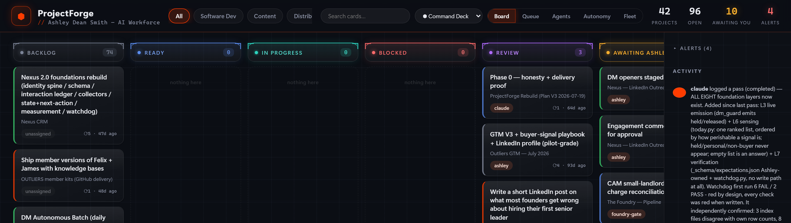

### 2026-06-12: the board in 1 day

Ashley built ProjectForge in a single day as a "work operating system" for his agents. It had a SQLite database (a single file on disk), a web server at the address http://127.0.0.1:3020 written in plain Python, using only the parts that come with Python, a hand-written JavaScript board, and a plain-text copy of the whole board saved as a note in his vault. He kept the program's code apart from his own settings so it could be packaged for other people. This download is built from that separated code.

The same day he added an always-on background program that checked the board every 15 minutes for cards that were overdue, untouched for days, stuck, or had no owner, and archived cards done more than 14 days earlier. It used no AI.

### 2026-06-13: other systems feed in, and the loop that hands out work

Small scripts, called adapters, read Ashley's other systems and pushed their work onto the board every 30 minutes. Re-running never created copies: each card was matched on the program it came from plus that program's own reference number for it, so the same item was never added twice.

Then the loop that hands out work: the board ranks the ready cards, marks the top card as taken (Ready to In Progress), and once the agent reports, saves the report and moves the card. The `/forge-run` command in Claude Code runs that loop.

He also made it run by itself: every 15 minutes a scheduled job on his PC started Claude Code in the background with no window (`claude -p` runs Claude once on a single instruction, then exits) and told it to run `/forge-run`.

2 bugs appeared that day and were fixed:

- The limit of 10 cards in progress was filled by 18 cards copied in from his other systems only to show their status, with no work in them for an agent, so no real card could ever be handed out. The fix was an 8th column, **Tracking**, that never counts against the limit.
- A card the orchestrator had just taken was put back in its old column by the next 30-minute update from the adapters. The fix: once the orchestrator has taken a card, the board refuses any adapter update that would change that card's column.


### 2026-06-14: git, a desktop app, and the rule that only 1 session moves cards

The code went into git, the program that keeps every past version of a file (33 files, 5,011 lines), and was packaged as a desktop app. Ashley then set the rule this download is built around: managers open cards, workers only add reports, handovers and comments, and only the orchestrator moves a card. The shared tool `forge_agent.py` was built so every agent writes to the board the same way.

He also counted the first 7 days: **3 cards done, 18 times Ashley stepped in, 4 cards handed out**. 3 finished cards against 18 times he stepped in meant the loop made more work for him than it saved.


### 2026-07-08: the 15-minute automatic start was switched off

The board cost nothing to run, but starting Claude every 15 minutes did: the scheduled job started a fresh Claude session to run `/forge-run`, whether or not there was work, and every start cost a full session before anything had looked at the board. The board was usually empty.

The surviving log shows **304 automatic runs of `/forge-run` between 2026-07-04 and 2026-07-08, about 69 a day, and every one found 0 cards to hand out**. 40 of those runs were read one by one: none of them handed out any work. Ashley's records put the total at about 230 million tokens of text read by Claude over 30 days (that figure is from his notes, not re-measured). On 2026-07-08 he switched it off completely.

So this download never starts Claude unless a check with no AI in it finds a card in Ready.

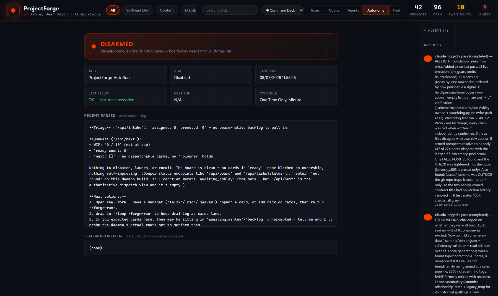

> **Note:** On 2026-07-19 a single run of `/forge-run` was measured on Anthropic's smallest model at that time, started in a folder where Claude had no agent files to read: it cost 0.094 US dollars (about 7p). A run costs more when Claude has more agent files and instructions to read before it starts.

### 2026-07-19: the rebuild plan and the handover standard

Ashley wrote a new plan in a single day, in 3 rounds: version 1, a critique, version 2, a critique, version 3. The aim was agents that work like independent employees, with Ashley needed "barely ever". The same evening he ruled that "handoff occurred at [time]" is not a handover, and set the 5 fields. The first stage of the plan stopped a card's "last activity" time changing when an adapter only re-sent the card unchanged, and made every change name who made it.

The plan said the database should refuse a thin handover. **That refusal was never built** in the original. The rule only worked when the person recording the work remembered it.

### 2026-09-22: what changed for this download

- **The handover refusal is built.** The board refuses a handover missing any of the 5 fields, and the decisions field must say why (it must contain "because", or say "none").
- **The board's own program checks the rules**, not only the instructions you give your agents, and every refusal is written to the Activity list in red, with the agent's name.
- **Nothing starts Claude on a clock by default.** You run `/forge-run` when you want it. The optional schedule runs a Python check first and exits without starting Claude when nothing is ready.
- **Agents write straight into the database**, so their reports are kept even when the web board is closed. In the original, a report sent while the board was down was not recorded.
- **Safety fixes found in testing on 2026-09-22**, before any member had it: before this fix, any website you had open in your browser could quietly add, move or archive cards on your board, and the board now refuses changes that do not come from its own page; every change made with `forge.py` (the board's terminal commands) must name who made it; the orchestrator can no longer take a card out of Awaiting You; a card cannot be taken twice; starting a second board at the same address (http://127.0.0.1:3020) now stops with a message instead of starting silently.
- The "Awaiting Ashley" column is now "Awaiting You". Every folder path comes from a single settings file the installer writes. The desktop app and the adapters written for Ashley's own systems were left out.

### 2026-09-23: a second round of fixes, from testing the download itself

A test that made 231 changes to the board in a row, and a second read of the whole guide by someone using the board for the first time, found 12 faults before any member had the download. All 12 are fixed, and each fix has its own check that failed before the fix and passes now:

- **A due date typed in words used to stop the health check for good.** `--due "tomorrow"` was accepted, and from then on every check died on that one card: no alerts; cards an agent took and never reported back on were no longer sent to Ready after 45 minutes; finished cards were no longer put away after 14 days; and nothing on screen said why. A due date must now be written as YYYY-MM-DD, and the board refuses anything else the moment you type it; a bad date already saved raises an alert on that card instead of ending the run; and a health check that fails for any reason now says so **on the board**, in red, with an alert.
- **The Activity list grew as long as everything in it**, pushing the whole page down. On a board with 40 changes on it, the page grew to 3,634 pixels on a 768-pixel screen, and every "+ Add card" button sat about 2,800 pixels further down than the bottom of the screen, so you had to scroll to reach any of them. The list now scrolls inside itself, and "+ Add card" has moved to the top of each column. Measured again: the page is 849 pixels tall, and all 7 "+ Add card" buttons are on screen without scrolling.
- **The board stopped refreshing while a card was open** and showed an out-of-date figure with nothing to say so: "4 refused today" for 25 seconds while the true number was 7. It now keeps refreshing behind an open card, and pauses only while you are typing, saying so when it does.
- **A `Today.md` saved in an older text format** (an accent, a pound sign, a curly quote), the kind some older PC programs still write, crashed the CRM reader. It now opens anyway: any letter the old format cannot spell comes through as a question mark instead of stopping the run.
- **A `config.json` edited by hand** gave a wall of error text from every command. A file saved with the "UTF-8 with BOM" setting some text editors offer, which puts 3 hidden characters at the start of the file, is now read without complaint, and a comma left after the last setting now gives 1 sentence naming the line it is on.
- **Uninstalling while a file inside `~/.claude/projectforge` (the folder your agents' tool is kept in) was open** crashed half way, after the `/forge-run` command had already been taken out. The uninstaller now tries to move that folder aside first, before it takes anything else away; if a file in there is open it names what to close, changes nothing else, and works when you run it again.
- **The summary note was written into a folder the board made up** when the vault was missing, and reported success. It now refuses and names the folder.
- **A member with no Obsidian vault could not install.** Question 1, your second brain vault folder, now takes `none`: the same answer question 2 already took for your CRM folder.
- **An agent asking for a person left no mark.** It now marks the card, counts it in the header, moves it into Awaiting You and raises an alert.
- **Every line in the Activity list said "you created this" without naming the card**, 11 times in a row. Every line now names the card and its project.
- **The Done column sat off the right-hand edge** on both screens we tested, 1366 and 1920 pixels wide, and the scroll bar that would have taken you there was almost the same colour as the near-black board behind it. There is now a bar naming every column, the Alerts and Activity panel folds away with a **Hide** button, and the board's own scroll bar is the accent colour.
- **Smaller fixes:** a search with no matches says so; refusals on the board no longer show the full command an agent typed; every alert links to its card; and the installer needs Python 3.11 or newer.

### What this borrows, and from whom

No outside code is in this download. Every line of it is ours, published under the MIT licence, which the `LICENSE` file in the folder sets out: you may use it, change it and pass it on. What the board borrows is ideas:

- **Columns and cards** come from kanban boards, which Trello made familiar to most people: columns, drag and drop, checklists and tags.
- **Only 1 writer may change a record** comes from the way databases are built, where it is called the single-writer rule. Here it means only the orchestrator, or you, moves a card between columns.
- **The labels on work reports and handovers** are mostly the word list from FIPA ACL, a published standard for messages between software agents written between 1997 and 2002. INFORM, REQUEST, PROPOSE, ACCEPT, REFUSE, FAILURE and QUERY are its words; DELEGATE and ESCALATE are ours. We reuse the words only: none of that standard's code is here.
- **The 5-field handover** is shift-handover practice, the kind hospitals and control rooms use, applied to agents. Ashley set the 5 fields on 2026-07-19 after reading a card that said "handed over" and nothing else.
- **Check before you start the expensive part:** `tools/run_if_ready.py` counts the ready cards, with no AI, before it decides whether to start Claude at all.
- **The small file that starts the board when you switch on your Mac and sign in** is a LaunchAgent, the way macOS itself starts a program when you sign in, so nothing is downloaded for it.
- **The link from a card to a person** uses Obsidian's own `obsidian://open?path=` address format, which Obsidian documents.

While it runs, the board uses the Python standard library and nothing else: there is no package to install and nothing to keep up to date. The automatic checks use pytest (MIT licence). The pictures in this guide were taken with Playwright (Apache 2.0 licence), which you do not need in order to run the board. The full table, a row per idea, is `WHAT-I-STOLE.md` in the download folder.

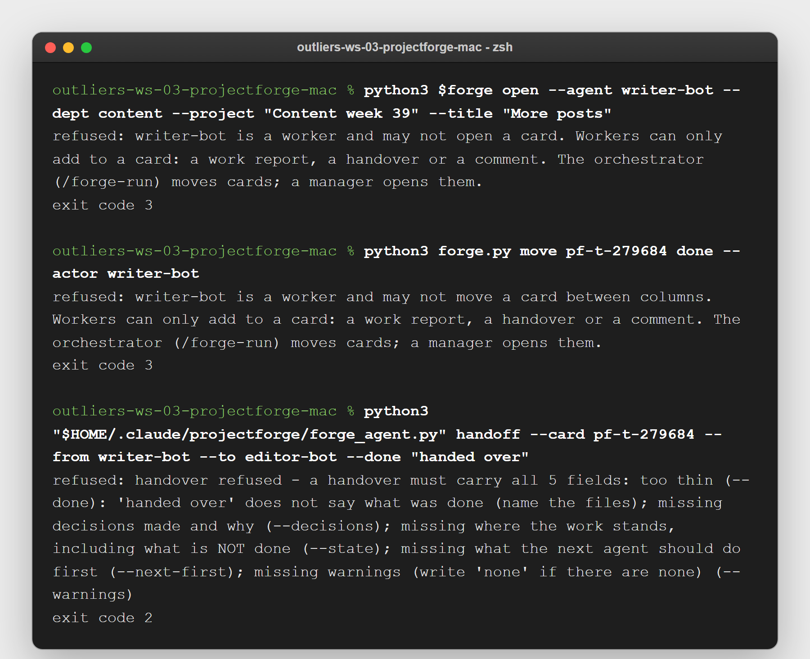

## Pros and cons

| | For | Against |
|---|---|---|
| Cost | The board, the health check and the CRM reader use no AI and cost nothing to run. | Each `/forge-run` is a full Claude Code session. Ashley's 15-minute automatic start ran about 69 of them a day for no work. Only run it when something is ready. |
| Visibility | A single place to see what every agent did, on which job, with which files and what comes next. | Agents only write to it if their instructions say so. Before 2026-06-14, 0 of Ashley's 77 agent files wrote to his board. |
| Safety | Only the orchestrator (the `/forge-run` session) moves cards; only you take a card out of Awaiting You; work that reaches other people stops in Review; refusals show in red. | Every command ends with `--actor` and a name. An agent can type `--actor you` and the board records the change as yours. The rules catch mistakes; they do not catch an agent that gives a false name. |
| Handovers | A handover missing any of the 5 fields is refused before it is saved. | Agents need a few extra lines of instruction to write good ones. |
| Busy-work | The Queue tab lists every card that is waiting, in the order it would be handed out. | Agents that can open cards may open cards for work nobody needs. Ashley's first week: 3 cards done against 18 times he stepped in. His board on 2026-09-22 had 74 cards in Backlog and 0 being worked. |
| Size | About 6,250 lines of plain Python and plain JavaScript, not counting the checks. Your own Claude can read and change all of it. | With 3 to 5 agents, a simple list in your vault may be enough. The board is worth installing once your agents hand work to each other. |
| Time | Install takes about 5 minutes. | Wiring your agents in takes 20 to 30 minutes: a few lines pasted into CLAUDE.md, the instruction file every Claude Code session reads, and a few more into each agent's own file. |

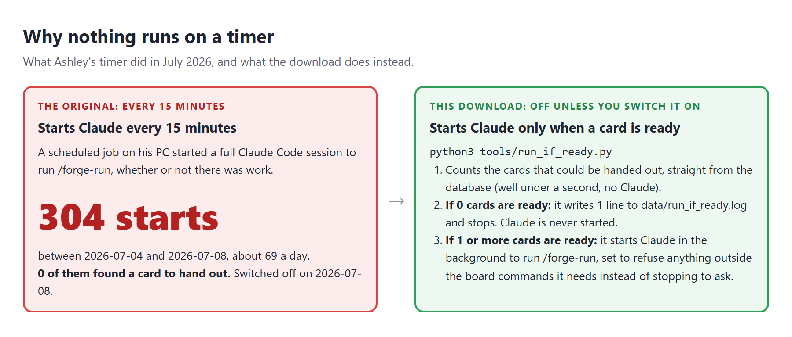

## Before you start

### Before you start on a Mac

**Python.** Install Python from https://www.python.org/downloads/macos/ (the link labelled "macOS installer"; we tested 3.14.7). When it finishes, double-click **Install Certificates.command** and **Update Shell Profile.command** in the Python folder inside Applications, then open a new Terminal window. Check with `python3 -c "import sys; print(sys.prefix)"`: it should print a line starting `/Library/Frameworks/Python.framework`. If it starts `/opt/homebrew` or `/usr/local/Cellar`, your Terminal uses Homebrew's Python (Homebrew is an add-on installer many Mac owners use). Every command here still works. The self-checks run from a private Python folder: a folder in your home folder with its own copy of Python's add-ons, which works with python.org's Python and with Homebrew's.

**The first time you type `git`.** Your Mac may show a box asking to install the command line developer tools. Press Install, wait until it has finished, then type the `git` line again.

**If Terminal says `claude` is not found,** type the line below. It adds the folder Claude Code is installed in to the list of folders Terminal looks in for programs. Then open a new Terminal window and check with `claude --version`.

```
echo 'export PATH="$HOME/.local/bin:$PATH"' >> ~/.zshrc
```

**Your second brain** is at `~/Second Brain` on a Mac, a folder in your home folder, not in Documents, because macOS can stop a program that starts by itself from opening your Documents folder. If a page says "macOS refused access to" a folder, move that folder into your home folder and run `python3 install.py` again.

**"Allow Python to find devices on local networks?"** If macOS asks this the first time the page opens, press Allow.

**Apple Silicon or Intel** (the 2 kinds of chip a Mac can have; the Apple menu, then About This Mac, shows yours): the steps are the same on both, and both were tested.

**Tried only on test Macs** (Macs GitHub rents out by the minute to run scripts, not a person's own Mac): 3 of the steps above were never tried on a real Mac. They are the developer-tools box, macOS stopping a program from opening Documents, and the question about devices on local networks.

Later, if you ask the board to start by itself when you switch on your Mac and sign in, you can check that your Mac started it: type `launchctl list | grep outliers`, and a line ending `ai.outliers.projectforge` means it is running.

| You need | How to check |
|---|---|
| Python 3.11 or newer (tested on 3.14.7 on a Mac) | Open Terminal and type `python3 --version`. The installer refuses anything older and changes nothing: Python 3.9 stopped getting security fixes on 2025-10-31, and 3.10 gets them only until 2026-10-31 (python.org, checked 2026-09-24). |
| Git | `git --version` |
| Claude Code, logged in to your Claude account | `claude --version`. A test Mac printed 2.1.282 (Claude Code) on 2026-09-25. |
| Optional: your second brain vault | You know its full path, for example `/Users/<you>/Second Brain` (the `Second Brain` folder in your home folder). If you have not got one, type `none` at question 1 and everything else works the same. |
| Your agents folder | Usually `~/.claude/agents`. |
| Optional: your CRM vault | The folder that contains `Today.md` (your CRM's ranked list of people to contact today) and `People/`. |
| Optional, for the tests: pytest (a program that runs the download's automatic checks) | Installed into a private Python folder with the 2 lines below the table. |

For the tests, make a private Python folder once and install pytest into it. These 2 lines work whichever Python your Terminal uses; the part before `&&` switches this Terminal window into the private folder, so the `python` after it is the folder's own copy:

```
python3 -m venv ~/outliers-checks
source ~/outliers-checks/bin/activate && python -m pip install pytest
```

You do not need Node.js (another programming tool some downloads ask for). Nothing is installed from the internet except the download itself: the board needs nothing beyond what comes with Python.

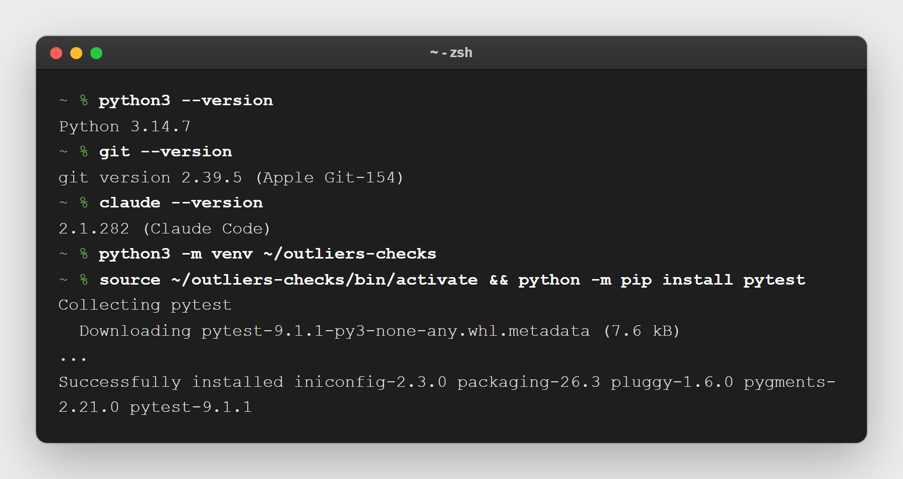

## Install it

1. Open Terminal (press Command and Space together, type Terminal, press Return). It opens in your home folder, which is where all 4 downloads in this set go.
2. Download the code and start the installer. Type the 3 lines below one at a time, pressing Return after each:

```
git clone https://github.com/OUTLIERS-ai/outliers-ws-03-projectforge-mac
cd outliers-ws-03-projectforge-mac
python3 install.py
```

3. Answer the 9 questions. Most offer a default in square brackets; press Return to accept it. Questions 4, 5 and 9 have no default that does anything: press Return for nobody at 4 and 5, and for no at 9. If you run the installer a second time, each question offers your last answer instead, so type `no` at 9 to switch it off.
   - Question 1: your second brain vault folder, **or `none` if you have not got a vault**. With `none`, questions 7 and 8 answer themselves and the board works exactly the same: the only part you lose is the summary note, which lives in a vault. The installer finds a vault by itself only once Obsidian has opened it (it looks for Obsidian's hidden `.obsidian` folder), so a new second brain shows `[none]` here: type its full path, for example `/Users/<you>/Second Brain`, putting your own user name where `<you>` is. The installer does not understand `~` at this question.
   - Question 2: your CRM vault folder, typed as a full path in the same way, or `none`.
   - Question 3: your agents folder. The installer lists every agent it finds.
   - Question 4: which agents are **managers** (may open cards). Press Return and only you open cards.
   - Question 5: which agents send work to other people. Their finished cards stop in Review.
   - Question 6: what the board calls you (default `you`). Remember it: you type it after `--actor` at the end of every terminal command that changes the board.
   - Question 7: where the `/forge-run` command goes: `user` (every Claude Code session) or `vault` (only sessions in your second brain).
   - Question 8: the board summary note, a note in your vault that lists the whole board and is rewritten after every change: pressing Return writes it into your vault at the path shown. Type `none` if you do not want one.
   - Question 9: should the board start by itself each time you switch on your Mac and sign in? Press Return for no. See step 7 below before you decide.
4. The installer shows every file it is about to write and asks "Go ahead?". Type `y`.
5. When it worked you see a list of `done:` lines like this:


6. Open the board: `python3 forge.py serve`, then visit `http://127.0.0.1:3020` in your browser (127.0.0.1 means your own computer; nothing goes online). There is no login and no wait. **If the terminal says this board is already running**, it is: open the address it names. **If it says port 3020 is already in use**, another board or another program is answering on that number: run `python3 forge.py serve --port 3021` instead, and visit `http://127.0.0.1:3021`. Any free number works; 3021 is the next one along. The terminal prints the address and then stays quiet while the board runs. That is normal. Leave the window open. To stop the board, press Ctrl+C in it, or open a second Terminal window and type `cd outliers-ws-03-projectforge-mac`, then `python3 forge.py serve --stop`. The name under "ProjectForge" comes from the `workspace` line in `config.json`, the settings file the installer wrote; change it there.

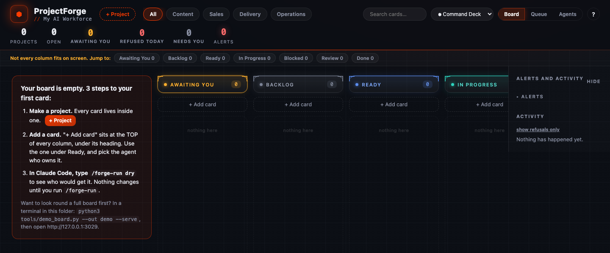

7. **Decide whether the board starts by itself when you switch on your Mac and sign in.** The board only answers while the program is running, so closing that Terminal window, or restarting your Mac, takes the board away until you start it again. Answer yes at question 9 and the installer writes a LaunchAgent: a small file, `ai.outliers.projectforge.plist`, in the `~/Library/LaunchAgents` folder, that tells your Mac to start the board each time you switch on your Mac and sign in, with no window at all. It is off unless you ask for it, and the installer shows you the exact path before writing it. The file takes effect the next time you sign in; until then, start the board with `python3 forge.py serve`, as in step 6. To change your mind, run `python3 install.py` again and answer the other way at question 9, or take the file away with `python3 install.py --uninstall`. To switch it on from a script rather than by answering: `python3 install.py --start-with-computer` (this setting means yes at question 9). A board started this way has no window, so there is nothing to press Ctrl+C in. To stop it, open Terminal (it opens in your home folder), type `cd outliers-ws-03-projectforge-mac`, then `python3 forge.py serve --stop`. Start it again with `python3 forge.py serve` in the same folder, and check it by opening `http://127.0.0.1:3020` (or the port you chose) in your browser, where a page that loads means it is running. `launchctl list | grep outliers` lists the LaunchAgents your Mac has started.
8. The board opens empty, with 3 steps on the left. Your first card: click "+ Add card", which sits **at the top of every column, under its heading**, and use the one under Ready. Because there is no project yet, the form asks you to name one, and the card and the project are made together.

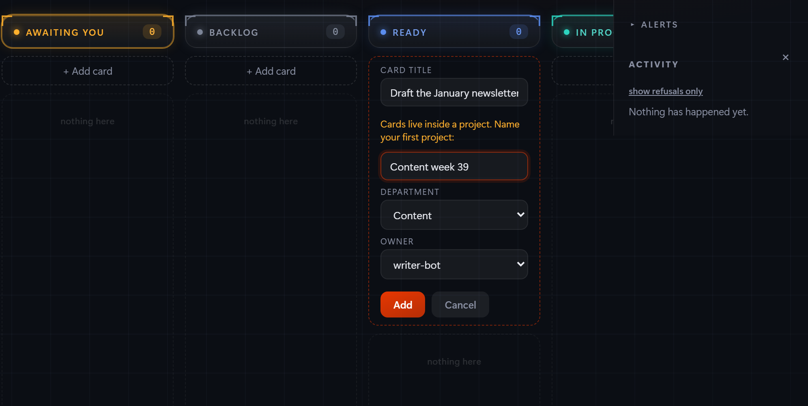

9. Open the file `data/CLAUDE-snippet.md` inside the download folder. Paste the first part into the CLAUDE.md that every session reads, `~/.claude/CLAUDE.md` (or the CLAUDE.md in your vault if you chose `vault` at question 7). Paste the second part into each worker agent's file. This is what makes your agents log their work.
10. In Claude Code, type `/forge-run dry`. It reports what it would do and changes nothing.

> **Tip:** Want to see a full board first? Run `python3 tools/demo_board.py --out demo --serve` and open `http://127.0.0.1:3029`. It builds a separate demo board of made-up work, with a made-up CRM vault, and does not touch your real one.

> **Note:** If a file called `forge-run.md` already exists in your Claude Code commands folder (`~/.claude/commands`), the installer copies it to `forge-run.md.bak-<date>` before replacing it. Running the installer a second time with the same answers changes nothing. `python3 install.py --uninstall` asks you to type y, then stops the board if it is running, takes away the LaunchAgent that starts the board when you switch on your Mac and sign in (if you asked for one), takes the command out, moves the agents' tool into a folder named `projectforge.removed-<date>`, puts your own old command back (even if you installed twice), and leaves your board data alone. It only takes away a start-up file it wrote itself: a file of the same name that you or another program put there is left alone and named on screen. It never edits your CLAUDE.md or your agent files. The lines you pasted in at step 9 still tell your agents to run `forge_agent.py`, which it has just moved aside, so it prints the file and the number of each line to take out, for example `line 7: Agent work is recorded on the ProjectForge board. The tool is`. It also lists any line in an agent's file that names `forge_agent.py`. Open each file it names, delete those lines and the blank lines between them, and save it. **To remove the whole download** after that, delete the `outliers-ws-03-projectforge-mac` folder. Your cards and their history are in `data/forge.db` inside it, so copy that file first if you want to keep them.

## Using it day to day

**Adding work on the board.** "+ Project" sits at the top of the screen. "+ Add card" sits at the **top** of each column, under its heading, with a project picker and an owner picker, each labelled. The owner picker only lists you and your real agents, so a typo cannot create a made-up agent.

**Finding a card.** The search box filters every tab. If nothing matches what you typed, the board says so and gives you a "Clear the search" button, instead of showing 7 empty columns that look like an empty board.

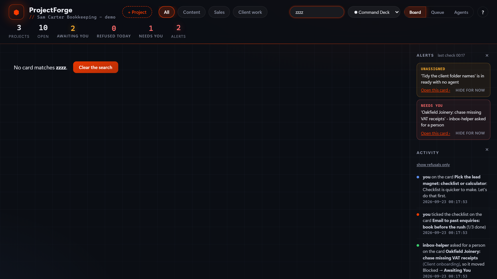

**Adding work from the terminal.** `forge.py` commands run inside the ProjectForge folder; in a new Terminal window, type `cd outliers-ws-03-projectforge-mac` first. Make a project first; it prints the project's id, a short code such as `pf-p-5baff3` that you use to add cards to it. Then add a card to it. Every command that changes the board ends with `--actor` and your board name (the answer to question 6; `you` if you kept the default):

```
python3 forge.py add-project "Content week 39" --dept content --actor you
python3 forge.py add-task pf-p-5baff3 "Draft 3 posts" --status ready --agent writer-bot --actor you
```

`writer-bot` stands for one of your own agents; type its real name. `pf-p-5baff3` stands for the id your own project printed.

The installer sets up 4 departments: content, sales, delivery and operations. Any other name is refused until you add it to `config.json` yourself. You can drop one, and you can give any of them whatever name you like on screen: the demo board in these pictures has 3, and shows delivery as "Client work". `python3 forge.py projects` lists every project with its id.

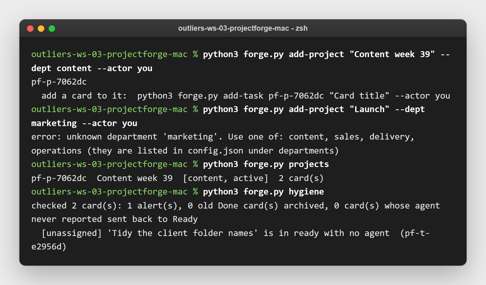

**What your agents run.** The installer puts the agents' tool, `forge_agent.py`, in the `~/.claude/projectforge` folder (inside your home folder). It is not in the download folder, so to try it yourself give its full path. Type these 2 lines in the same Terminal window:

```
forge="$HOME/.claude/projectforge/forge_agent.py"
python3 $forge open --agent content-lead --dept content --project "Content week 39" --title "Newsletter" --assignee writer-bot
```

The first line saves the tool's full path under the short name `forge` (`$HOME` is your home folder), so the second line fits on 1 line. Type the name of 1 of your managers after `--agent` (question 4 at install). If you pressed Return there, you have no managers, and the board answers `refused: content-lead is a worker and may not open a card`. That is the first rule doing its job; open the card on the board instead, or re-run `python3 install.py` and name a manager. The full list of its commands is under "Every command and setting" below.

**Letting the agents work.** When cards are sitting in Ready, type `/forge-run` in Claude Code (or `/forge-run 3` to run at most 3 cards). The orchestrator:

1. checks how many cards can be handed out, and stops straight away if the answer is 0;
2. moves Backlog cards that have an owner to Ready. It gives an ownerless card an owner only if you set up keyword routing (idea 6 below); otherwise the card waits for you to pick an owner;
3. for each ready card: takes it, starts the owner agent with the card's full history, saves the agent's report, and moves the card to the column that matches the result: "completed" to Done, "needs-review" to Review, "failed" or "blocked" to Blocked. If the result is "progressed" (partly done), the card goes back to Ready for the next run.

> **Warning:** Backlog cards with an owner do not wait. Any Backlog card with an owner is handed out on the next `/forge-run`. To park a card, give it the tag `someday` (or `icebox` or `parked`).

**Reading a card.** Click anywhere on it. The top shows the owner, the CRM person link and the checklist. Further down are the work reports and the handovers, each with its 5 fields. A handover also makes the receiving agent the card's new owner. Edits at the top are kept when you add a tag, tick the checklist or comment; if you press Escape with unsaved edits, the board asks first. The board refreshes every 10 seconds, but never while you are typing.

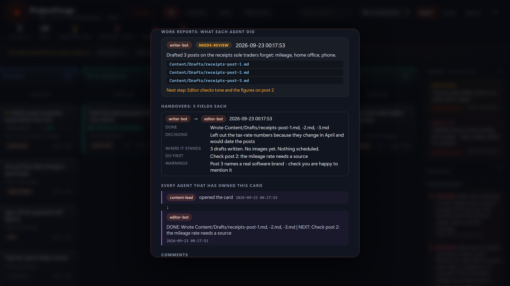

**The Queue tab** shows the Ready cards in the order they would be handed out (priority, then due date, then age) and says why a card cannot go: it has no owner, it is yours, its owner is not one of your agents, or In Progress already has its limit of 10 cards.

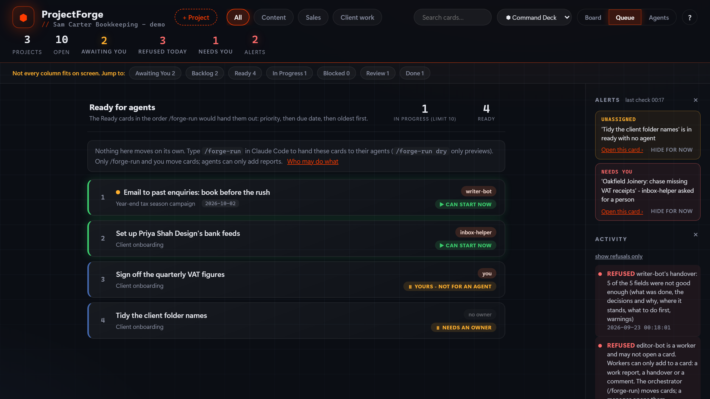

**The Agents tab** shows every agent you installed, managers first, each with a label saying manager or worker, its open cards and its last 8 results as coloured dots. A key to the dots is at the top.

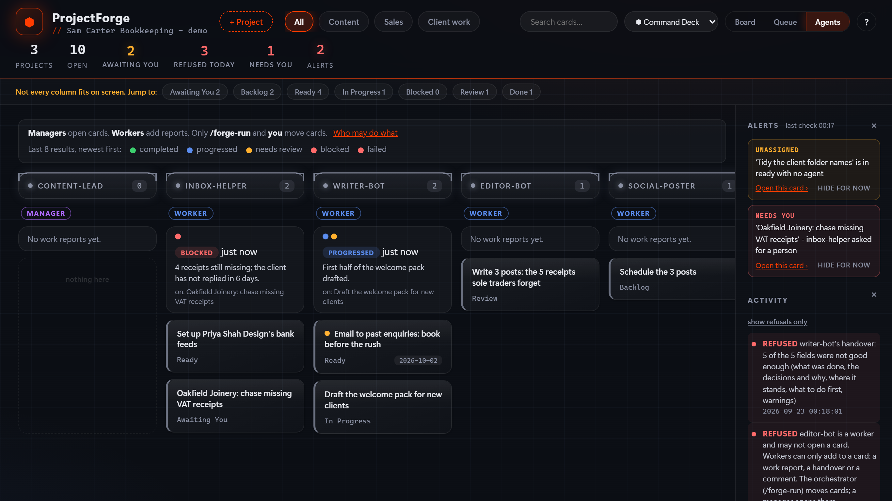

**Your column.** Check Awaiting You once a day. Every card there is waiting for your decision or sign-off. Click the "awaiting you" number at the top to jump to it.

**Refusals and escalations.** The "refused today" number at the top counts the changes the board refused. Click it, or "show refusals only" in Activity, to see who tried what. The wording you see on the board is the plain one; the agent's own terminal gets the longer version, which names the missing parts of the command it must supply, such as `--decisions` or `--warnings`.

**When an agent asks for a person.** An agent that cannot finish without you runs `forge_agent.py escalate`. That leaves 3 marks you cannot miss: a red **NEEDS YOU** label on the card, a **needs you** count in the header, and the card moves into **Awaiting You**, your own column. The health check also raises an alert for it, so it is still there tomorrow after the Activity list has scrolled past it.

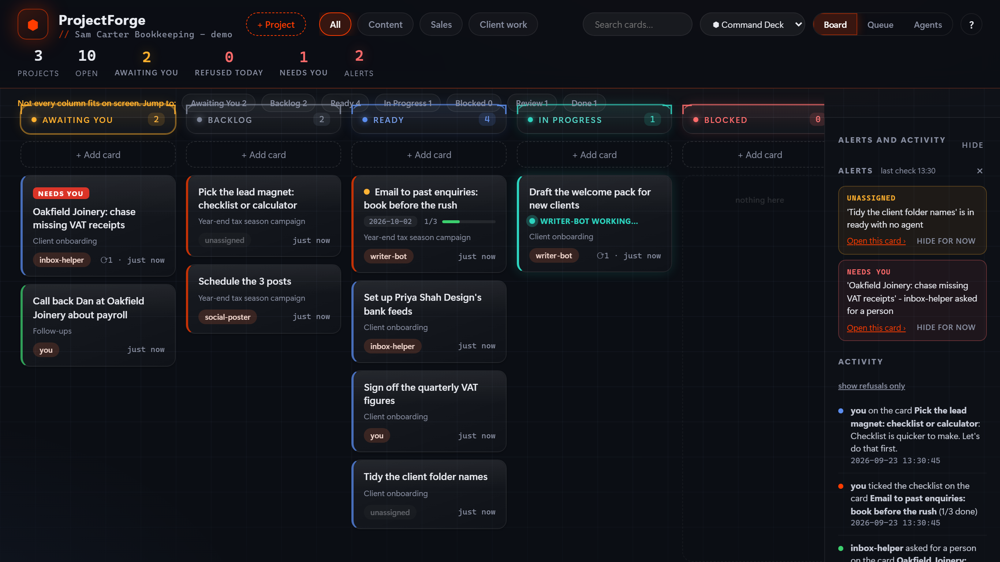

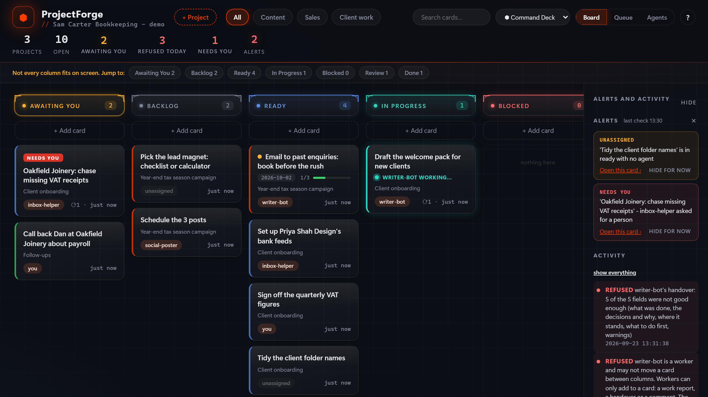

**Health check.** The board runs a no-AI check when it starts and every 10 minutes: overdue, due soon (2 days), untouched for 5 days, stuck in Blocked (3 days), no owner, too many cards in a column, and any card where an agent has asked for a person. The cards it finds are listed under Alerts on the right (with the time of the last check) and at the top of the summary note. It also sends a card back to Ready if its agent never reported within 45 minutes, and archives Done cards after 14 days. `python3 forge.py hygiene` runs the same check once and prints the cards.

Each alert names its card, and under it sits an "Open this card" link that takes you straight there. "Hide for now" puts an alert away; the next check puts it back if it is still true.

**If the health check ever stops**, the board says so in red where the time of the last check normally sits, and raises an alert naming the reason. It used to print 1 line into the terminal window you had minimised, so the check could be dead for days while the board looked fine.

**The board refreshes every 10 seconds** and pauses only while you are typing: in a box, or in a half-filled "+ Add card" form. When it pauses it says so in an amber line under the header, with the time it last looked. Having a card open no longer stops it: the figures at the top stay right while you read a card.

**Letting it run by itself (optional).** `python3 tools/run_if_ready.py` checks first and starts Claude only if a card is ready. It prints 1 line and writes the details to `data/run_if_ready.log` rather than the screen; 1 run can take up to 45 minutes. It starts Claude with a Claude Code setting called dontAsk, which refuses anything not on an approved list instead of stopping to ask a question: nobody is there to answer questions, so it may use exactly the board commands below, plus whatever you have already allowed in your own Claude Code settings, and nothing else. This was tested live on Ashley's own PC on 2026-09-22: the board commands ran and every other command was refused. It was not run on a Mac, because it starts Claude, which needs your own Claude Code login.

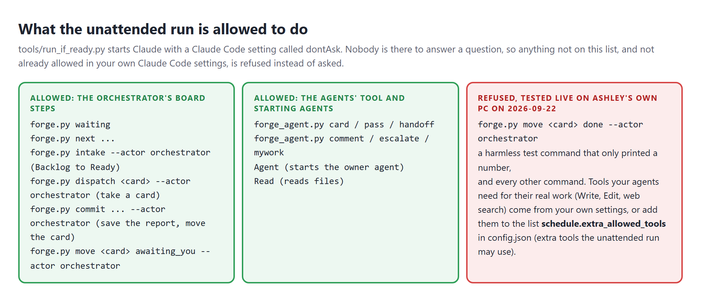

## Fit it to your own AI system

**The safe way.** Change a practice copy, never the board you use every day. Open Terminal (it opens in your home folder) and type these 4 lines, 1 at a time:

```
cd outliers-ws-03-projectforge-mac
python3 forge.py make-copy ../projectforge-practice
cd ../projectforge-practice
python3 forge.py serve
```

The second line makes a new folder, `projectforge-practice`, beside the download (`..` means the folder above this one, your home folder). The copy has its own copy of today's cards in its own `data/forge.db`, and its board answers on the next free port, 3021 if nothing else has it, so both boards can run at once. The last line starts the copy's board and prints its address: open that address in your browser. Nothing you do in the copy reaches your everyday board: your agents and `/forge-run` keep writing to the everyday one, and the copy writes no summary note into your vault, has no start-up file and no schedule. Do not run `python3 install.py` in the copy: it refuses, because it would point your agents at the copy.

After every change, stop the copy's board with Ctrl+C and run the checks in the copy's folder, with the private Python folder from "Before you start":

```
source ~/outliers-checks/bin/activate && python -m pytest -q
```

Expect `157 passed, 1 skipped` (the skipped check looks at a file only a PC uses). Any other answer means the change broke something, so put it back before you go on. Read "Every command and setting" near the end of this guide before you ask Claude Code for a change, because much of what you want is already a setting in `config.json`. Be most careful with `engine/db.py`: a mistake there can damage cards, and in the copy those are only copies.

When the copy does what you want, copy the files you changed (never `data/` or `config.json`) into the download folder. Then stop the everyday board and start it again:

```
cd ../outliers-ws-03-projectforge-mac
python3 forge.py serve --stop
python3 forge.py serve
```

Take this download and alter it. It is yours now: change it until it matches how you work. Ashley wrote the first board in 1 day and then changed it for 3 months. His own copy has 5 tabs along the top, not 3: the board, the queue of what would be handed out next, his agents and what each has done, whether the job that starts Claude on a clock is switched on, and a map showing which of his agents hands work to which, which he moved onto this board after deciding that no second screen at a second web address was allowed to exist alongside it. It has colour themes, because he wanted the board to be easier on the eye at night. He added an 8th column, Tracking, the day he found 18 cards that only reported a status were filling the limit of 10 in progress and nothing could be handed out at all. Then the 5-field handover, after reading a card that said "handed over" and nothing else.

Each idea below comes with a prompt you can paste into Claude Code, opened in the ProjectForge folder: in a new Terminal window, type `cd outliers-ws-03-projectforge-mac`, then `claude`. Some ideas use settings you will find in `config.json` after installing; `config.example.json` shows them all filled in with examples.

### 1. Cards from your CRM's Today page

The download includes `adapters/crm_today.py`. It reads the ranked table on `Today.md` in your CRM vault and makes a card for each person in Awaiting You, linked to that person's note in `People/`. The table needs a rank number, the person's name (matching a file in `People/`), why, and when:

```
| 1 | [[Dan Pike]] | Asked about payroll | Call back today |
```

`[[People/Dan Pike]]` and `[[Dan Pike|Dan]]` work too. Run it with `--dry-run` first (a practice run that shows what it would do and writes nothing): "(no person note found)" means the name does not match a file in `People/`. Running it again updates the same cards instead of copying them. It never sends anything. On the card, and in the summary note, the person's name opens their note in Obsidian. To hand these cards to a research agent instead of you, set `crm_today.owner` in config.json.


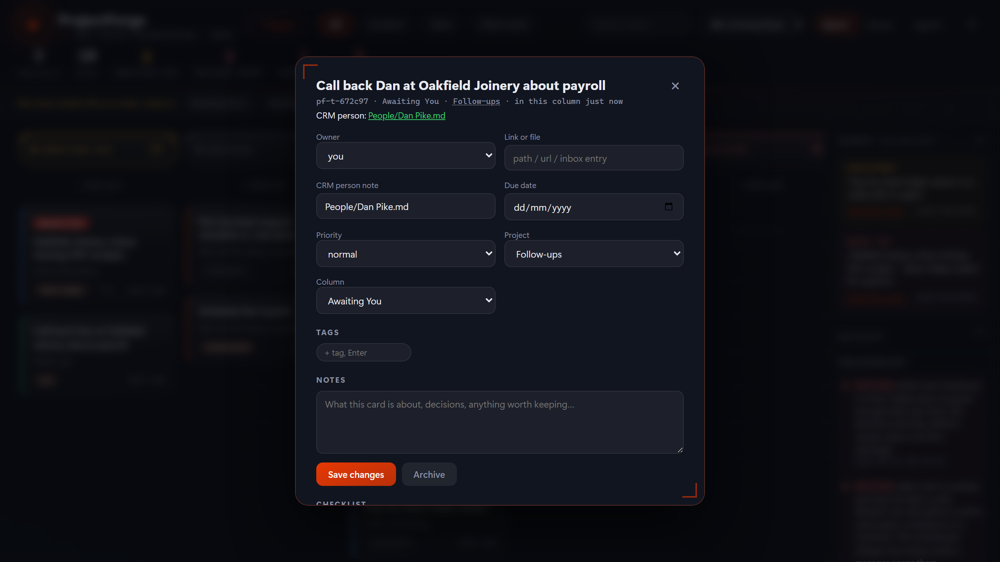

```
Run python3 adapters/crm_today.py --dry-run and show me the result. If it looks right, run it for real. Then add one line to the script that rebuilds my CRM's Today.md each morning so that after Today.md is rebuilt, crm_today.py runs straight after it.
```

### 2. Your second brain agents as owners and managers

```
Read config.json. Then read every agent file in my agents folder. Suggest which agents should be managers (they plan work and hand it out) and which are workers (they do a single kind of job). Show me the list, and when I agree, re-run python3 install.py with --managers set to the ones I approve.
```

### 3. Teach each agent to leave a proper report

```
Open data/CLAUDE-snippet.md. For each worker agent file in my agents folder, add the WORK REPORT paragraph at the end if it is not already there, and add a line telling it to save that report with forge_agent.py pass (the command that records a work report). Show me the change for each file before saving it, and back up each file first.
```

### 4. Content engine runs as cards

```
Read my content engine folder at <path to your content engine>. Write adapters/content_engine.py, modelled on adapters/crm_today.py, that creates a card per content piece the engine has made in the last 7 days, with the draft's file path in context_ref (the card's link-or-file field), owned by my editor agent, starting in Review. It must never publish anything. Add "content-engine" to federate_sources in config.json (the list of programs allowed to send cards in). Add a test in tests/ and run all the tests, using pytest from my private Python folder ~/outliers-checks.
```

### 5. "Awaiting You" in your daily note

```
Write tools/daily_block.py. It reads the board and writes a section called "Waiting for me" into today's daily note in my second brain (find the daily notes folder by looking at my vault), listing every card in Awaiting You and every card in Review. Replace only that section, never the rest of the note, and save it through a temporary file and os.replace, so a crash can never leave the note half-written. No AI.
```

### 6. Route cards by keyword

```
In config.json, fill intake.routing (the keyword rules that pick an owner) so that a card with "podcast" in its title goes to my podcast agent, "invoice" goes to my admin agent, and "thumbnail" goes to my design agent. Use the real agent names from config.json "agents". Then add a test to tests/test_store.py proving a card is routed correctly, and run the tests.
```

### 7. Every card must say which goal it serves

Ashley's worry about busy-work was agents creating work to stay busy. A cure is to refuse any card that does not say which goal it serves.

```
Add a "goal" field to cards in engine/db.py (with a migration like the others). Make open_card refuse a card whose goal is empty, with a clear message. Show the goal on the card in the web board. Add tests for the refusal and run all the tests, using pytest from my private Python folder ~/outliers-checks.
```

### 8. The optional schedule, set up safely

```
Run python3 tools/schedule.py --print and explain each line to me. Then set schedule.model in config.json to "sonnet" (Anthropic's mid-priced model) and schedule.every_min to 120. List the tools my agents need for their work that are not in allowed_tools() in tools/run_if_ready.py, and suggest what to put in schedule.extra_allowed_tools. Do not install the schedule (python3 tools/schedule.py --install) until I say yes.
```

### 9. Limits per agent

The file name decides which agent a limit file applies to: `cards/writer-bot.json` limits writer-bot.

```
For my 3 busiest worker agents, create a file in cards/ modelled on cards/example-agent.json.example, named after the agent (for example cards/writer-bot.json), and set its "slug" (the agent-name field) to the agent's exact name. Limit each to its own department and to 5 hand-outs a day. Run python3 forge.py cards --validate and show me the result.
```

## Every command and setting

The whole download at a glance, then every command. Anything that changes the board from the terminal names who made the change: `--actor <your board name>`, or, for `pass` and `handoff`, the agent's name.

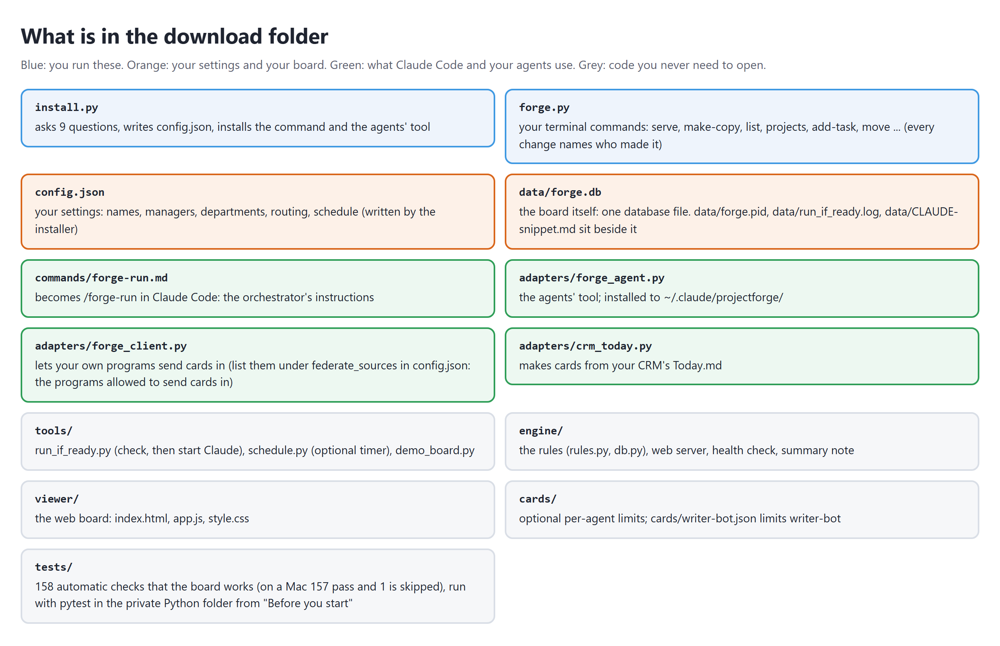

**`forge.py`: your commands.** Parts in [square brackets] are optional; leave them out to use the default.

| Command | What it does |
|---|---|
| `serve [--port 3020]` | Opens the web board and runs the health check every 10 minutes. |
| `serve --stop` | Stops the board that belongs to this folder, whichever port it is on and whether you started it yourself or it started by itself when you switched on your Mac and signed in. Type it inside the download folder. Use this when there is no window to press Ctrl+C in. It reads `data/forge.pid`, the small file the running board writes with its own process number (the number your computer gives every program while it runs) and port, then asks that address who it is: unless the answer is this folder's own board, it stops nothing and says so, so a record left over from an earlier board, or copied from another folder, can never end another program. |
| `make-copy <folder> [--port 3021]` | Makes a practice copy to change safely: the code, a copy of today's cards, and its own port, with no summary note, no start-up file and no schedule. See "The safe way" under "Fit it to your own AI system". |
| `daemon [--port] [--interval 10]` | The same as serve, except you set how many minutes there are between health checks: `--interval 10` means every 10 minutes. |
| `list` | Open cards in the terminal. |
| `projects` | Every project and its id. |
| `add-project "Title" --dept content [--summary "..."] --actor you` | A new project; prints its id. |
| `add-task <project-id> "Title" [--status ready] [--agent writer-bot] [--notes "..."] [--context <link or file>] [--crm-person "People/Dan Pike.md"] --actor you` | A new card. The 8 columns are backlog, ready, in_progress, blocked, review, awaiting_you, done, tracking. |
| `move <card> <column> --actor you` | Moves a card. |
| `set <card> [--due 2026-10-02] [--priority low/normal/high/urgent] [--agent <name>] [--crm-person ...] --actor you` | Changes a card's details. A due date must be written as YYYY-MM-DD; anything else is refused and nothing changes. `--due ""` clears it. |
| `archive <card> [--restore] --actor you` | Hides a card, or brings it back. Nothing is ever deleted. |
| `comment <card> "text" --actor you` | Adds a comment. |
| `pass <card> <agent> "summary" [--result ...] [--outputs a.md,b.md] [--next "..."] [--intent ...]` | Saves a work report for an agent. Never moves the card. |
| `handoff <card> <from> <to> --done --decisions --state --next-first --warnings [--context]` | A 5-field handover from the terminal. |
| `waiting [--json]` (add `--json` to print the answer in JSON, the standard text format programs read) | How many cards a `/forge-run` could hand out now, counting owned Backlog cards it will move to Ready first. Writes nothing. |
| `next [--limit 5] [--json]` | The Ready cards in hand-out order, with the reason any card cannot go. |
| `show <card> [--json]` | A card in full. |
| `metrics [--days 7]` | Cards finished, cards moved back to an earlier column, how often you stepped in. |
| `hygiene` | Runs the health check once and lists the cards it found. |
| `mirror` | Rewrites the summary note now. If the folder it should go in is not there, it refuses and names the folder rather than making one. |
| `cards [--validate]` | Lists or checks the per-agent limit files. |
| `intake`, `dispatch <card>`, `commit <card> <agent> "summary" --result ... [--key]` with `--actor orchestrator` | The orchestrator's own steps: intake moves owned Backlog cards to Ready, dispatch takes a card, commit saves the report and moves the card. `--key` stops the same report being saved twice. |

Results are completed, progressed, blocked, failed and needs-review. `--intent` (on pass, handoff and commit) is optional and records what kind of message the report is, so a later reader can sort them: DELEGATE (handing work out), REQUEST (asking for something), INFORM (just telling you), PROPOSE (suggesting), ACCEPT, REFUSE, FAILURE, QUERY (a question) or ESCALATE (asking for a person). Leave it out and nothing is lost.

**`forge_agent.py`: your agents' tool.** It writes straight into the database, so it works whether or not the web board is open. It finds the board through `forge_agent.json` next to it, or an environment variable (a named setting your computer passes to every program) called `FORGE_DIR`.

| Command | Who |
|---|---|
| `mywork <agent>` | Anyone: the agent's open cards and last report. |
| `card <card>` | Anyone: reads a card, its last 2 handovers and last 4 reports. |
| `pass --card --agent --summary [--result] [--outputs] [--next] [--key]` | Any agent. Saves a work report. |
| `handoff --card --from --to --done --decisions --state --next-first --warnings [--context]` | Any agent. Makes the receiver the owner. |
| `comment --card --agent --text` | Any agent. |
| `escalate --card --agent --note` | Any agent. Marks the card NEEDS YOU, counts it in the header, moves it into Awaiting You and raises an alert. |
| `open`, with `--agent <manager>` `--dept` `--project` `--title` `[--assignee]` `[--status backlog/ready]` `[--context]` `[--notes]` `[--crm-person]` | Managers only. A new project name makes a new project. |

**Other scripts.** `install.py` also takes every answer as a setting, for scripts: `--yes`, `--second-brain`, `--crm`, `--agents-dir`, `--managers`, `--outward`, `--name`, `--commands`, `--summary-note`, `--port`, `--start-with-computer` (yes at question 9: start the board by itself when you switch on your Mac and sign in), and `--uninstall`. `--yes` takes the default for every question except question 9, which stays off unless you add `--start-with-computer`: no script can put a LaunchAgent on your Mac without being told to. `tools/run_if_ready.py [--dry-run]` checks and starts Claude only if needed. `tools/schedule.py --print / --install [--every 60, in minutes] / --remove` shows, switches on or switches off the optional schedule (a LaunchAgent that launchd, the Mac's built-in scheduler, runs on a timer). `tools/demo_board.py --out demo [--serve] [--port 3029]` builds the demo. `adapters/forge_client.py` lets your own programs send cards to the board over its web address.

**Settings in `config.json`.**

| Setting | What it controls |
|---|---|
| `workspace`, `human`, `orchestrator` | The name under the logo, your board name, the orchestrator's name. |
| `managers`, `agents`, `outward_owners` | Who may open cards; your real agents (the owner picker); whose finished work stops in Review. |
| `departments` | The 4 departments, their colours, and an optional `lead` agent who gets ownerless cards. |
| `hygiene` | `check_every_min` 10 (run the health check every 10 minutes), `stale_days` 5 (warn about a card nobody has touched for 5 days), `blocked_days` 3 (warn about a card sitting in Blocked for 3 days), `due_soon_days` 2 (warn 2 days before a due date), `done_archive_days` 14 (put a finished card away after 14 days), `dispatch_ttl_min` 45 (minutes before a taken card whose agent never reported goes back to Ready), and the column limits: In Progress 10, Review 8, Awaiting You 10. |
| `intake` | `auto_pickup` (whether `/forge-run` moves owned Backlog cards to Ready), the tags that park a card so it is never handed out (`someday`, `icebox`, `parked`), and keyword `routing`. |
| `crm_today.owner` | Give CRM cards to an agent instead of you. |
| `federate_sources` | Programs allowed to send cards in (default `crm-today`). Anything else is refused. |
| `schedule` | `every_min` (how many minutes between checks), `model` (which Claude model the unattended run uses), `extra_allowed_tools` (extra commands that run may use), and `claude_path` (where Claude is installed, saved for you when you install the schedule). |
| `summary_note`, `second_brain`, `crm_vault`, `port`, `db_path` | Folder paths, the board's port and its database file. |

**The board itself.** Search box and department buttons filter every tab. 5 colour themes (Command Deck, Synthwave, Terminal, Paper and Minimal) sit in the menu at the top. Drag a card between columns, or up and down inside a column; dragging a card that an agent is still working on into Done asks first. A card has tags, a due date, a priority, notes, a checklist and an archive button. The **×** on an alert dismisses it. Keyboard users can Tab to a card and press Return to open it.

**The web address, for your own programs.** The board answers on `http://127.0.0.1:3020/api/...`. Reads: `state`, `events`, `agents`, `alerts`, `metrics`, `cards`, `next`, `waiting`, `task/<card>`. Writes (in JSON, the standard text format programs use to swap data; only from your own computer, and each must name an `actor`): `open`, `pass`, `handoff`, `federate` (another program sending cards in), `task/add`, `task/move`, `task/update`, `task/tags`, `task/checklist`, `task/comment`, `task/archive`, `task/reorder`, `project/add`, `project/update`, `alert/dismiss`, and the orchestrator's `intake`, `dispatch`, `commit`.

**Also in the folder:** `README.md`, `WHAT-I-STOLE.md` (the ideas this borrows and their licences), `LICENSE` (MIT: anyone may use and change the code), `guide/` (this guide and its pictures), and `tests/` (158 automatic checks that the board works: 157 pass and 1 is skipped, because that 1 looks at a file only a PC uses. Run them with `source ~/outliers-checks/bin/activate && python -m pytest -q`, after making the private Python folder in "Before you start"; they never need a particular port to be free, so they pass while the board is running, and every one of them points your home folder at a throwaway folder first, so none of them touches your real one).

## When it goes wrong

These are the real faults from Ashley's build and from testing this download, with the fix for each.

| What you see | Why | Fix |
|---|---|---|
| Your Claude usage climbs while nothing gets done. | A timer is starting Claude on an empty board. This was Ashley's biggest automatic cost in July 2026. | Never put `claude -p "/forge-run"` on a timer. Use `tools/run_if_ready.py`, which exits without starting Claude when nothing is ready. |
| Nothing is ever handed out, but cards sit in Ready. | The in-progress limit (default 10) is full, or the owner is not one of your agents. In the original, 18 cards that only showed a status from another system filled the limit. | Open the Queue tab: it says why each card is waiting. Put cards that only report a fact from another system in Tracking, which never counts. |
| A card jumps back to an older column. | Another program re-sent it with its old column. | Already fixed: once the orchestrator takes a card, or while it is in Awaiting You, a re-send can no longer change its column. |
| "refused: ... is a worker and may not move a card" | The rule that only the orchestrator (`/forge-run`) and you move cards. An agent tried to move a card. | Working as intended. The agent should save a work report with `forge_agent.py pass`; `/forge-run` moves the card. |
| "handover refused - a handover must carry all 5 fields" | A handover with a field missing or too short to be useful. | Fill in `--done` (name the files), `--decisions` (with "because"), `--state`, `--next-first` and `--warnings` ("none" is fine). |
| "the following arguments are required: --actor" | Every `forge.py` change must say who made it. | Add `--actor` and your board name, for example `--actor you`. |
| "no project with the id ..." | A wrong project id. | `python3 forge.py projects` lists them. |
| "unknown department 'marketing'" | Only the departments in config.json are accepted. | Use content, sales, delivery or operations, or add a department to config.json. |
| "This board is already running at http://127.0.0.1:3020" | Your board is already open. Most often it started by itself when you switched on your Mac and signed in, and it has no window for you to notice. | Open that address in your browser: that is your board. To start it afresh, run `python3 forge.py serve --stop` in the download folder, then `python3 forge.py serve`. |
| "Port 3020 is already in use by a ProjectForge board from another folder" or "... by another program" | A practice copy, or a program that is not the board, has the port. `serve --stop` typed here will not stop it, because it is not this folder's board. | Run this board on another port: `python3 forge.py serve --port 3021`, and visit `http://127.0.0.1:3021`. Or stop the practice copy from its own folder. |
| The board is running but you cannot find its window, and Ctrl+C is not an option. | You answered yes at question 9, so it started by itself, with no window, when you switched on your Mac and signed in. That is what you asked for. | Open Terminal, type `cd outliers-ws-03-projectforge-mac`, then `python3 forge.py serve --stop`. To stop it happening every time, run `python3 install.py` again and answer no at question 9, or `python3 install.py --uninstall`. |
| `serve --stop` says the board on record is not answering. | The board was ended some other way (Ctrl+C, or your Mac switched off), or the folder was copied from another one, so `data/forge.pid` names a process number that is gone or belongs to another folder's board. | Nothing is wrong. It stops nothing, clears the record, and says so. It never ends a program unless that program answers and calls itself this folder's board. |
| Your vault note was overwritten by a demo board. | During research on 2026-09-22, a copied settings file still pointed at a real vault note. It was restored from git. | The demo board never writes a summary note, and the installer shows the note's path before writing it. |
| The orchestrator reports "bad json". | In the original, a long dash (—, called an em dash) typed into a command's text broke the request. | `/forge-run` now uses `forge.py` commands instead of web requests. Still type hyphens, not em dashes. |
| An agent says the board was not found. | `forge_agent.json` is missing next to the tool. | Re-run `python3 install.py`. Or set an environment variable (a named setting your computer passes to programs) called `FORGE_DIR` to the download folder. |
| The unattended run logs "claude not found". | A LaunchAgent on a Mac does not get the list of folders your Terminal searches for programs, so it cannot find `claude`. | `python3 tools/schedule.py --install` saves Claude's full path and adds its folder to the schedule. |
| "a due date must be written as YYYY-MM-DD" | You typed a date in words or in day/month/year order. Before 2026-09-23 the board took it and the health check then died on that card every time. | Write it as `--due 2026-10-02`. `--due ""` clears a due date. The date box on the web board is different: it takes the day/month/year your browser uses, and saves it correctly whatever you see there. |
| An alert saying a card's due date cannot be read. | A bad due date saved before this fix, or put there by one of your own scripts. | Open the card and set the date again as YYYY-MM-DD, or clear it. Until you do, that card alone is skipped; every other card is still checked. |
| "THE CHECK HAS STOPPED", in red where the time of the last check sits. | The health check hit something it could not read. The board still opens and still shows your cards, but nothing is being checked: no new alerts, no cards sent back to Ready after 45 minutes, no Done cards archived after 14 days, and no summary note rewritten. | Read the alert beside it: it names the reason. Run `python3 forge.py hygiene` in Terminal to see the same message in full. |
| A wall of error text from every command, mentioning JSON. | `config.json` was edited by hand and broken: usually a comma after the last setting. | The message now names the line. Fix that line and save as plain UTF-8, or delete the file and run `python3 install.py` again. A file saved as "UTF-8 with BOM" is read without complaint. |
| The CRM reader stops with an error about a byte it cannot decode. | Fixed on 2026-09-23. `Today.md` had been saved in an older text format that some older PC programs still write. | Nothing crashes now. An accent or a pound sign in a name may come back wrong on the card, for example "Renee Cafe" as "Ren?e Caf?"; save `Today.md` as UTF-8 to fix the spelling. |
| The uninstall says it could not move a folder aside. | Something has a file in `~/.claude/projectforge` open: an editor, a Terminal window sitting in that folder, or a running agent. | Close it and run `python3 install.py --uninstall` again. Nothing was changed, so it is safe to repeat. |
| "the summary note was not written: the folder ... is not there". | Your vault has been renamed or moved, or a vault kept in a cloud folder has not synced yet. | Check the folder exists, then run `python3 forge.py mirror`. The board never makes a folder inside your vault, because it used to make an empty folder and report success. |
| "macOS refused access to" a folder, in the summary job's message or as an alert on the board. | macOS stopped the board reading that folder. Every refusal to read a folder is reported this way. | Move the vault out of Documents into your home folder, for example `~/Second Brain`, and run `python3 install.py` again. Not tested on a real Mac: the test Macs never refuse a folder. |
| A card carries a red NEEDS YOU label. | An agent ran `escalate`: it cannot finish without a person. The card has moved into Awaiting You. | Read the note in the Activity list or on the card, do the part only you can do, then move the card on. Moving it out of Awaiting You takes the label off. |

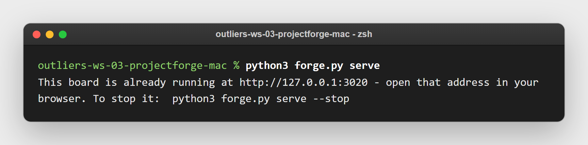

## Download

The code: https://github.com/OUTLIERS-ai/outliers-ws-03-projectforge-mac

Download and install with these 3 lines, pressing Return after each:

```
git clone https://github.com/OUTLIERS-ai/outliers-ws-03-projectforge-mac
cd outliers-ws-03-projectforge-mac
python3 install.py
```

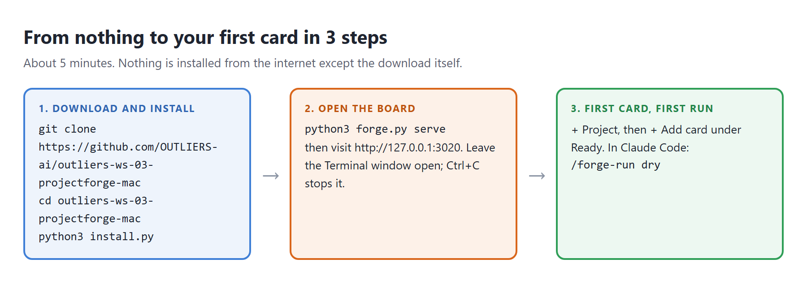
